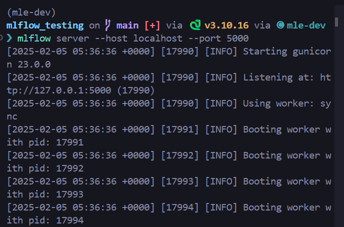
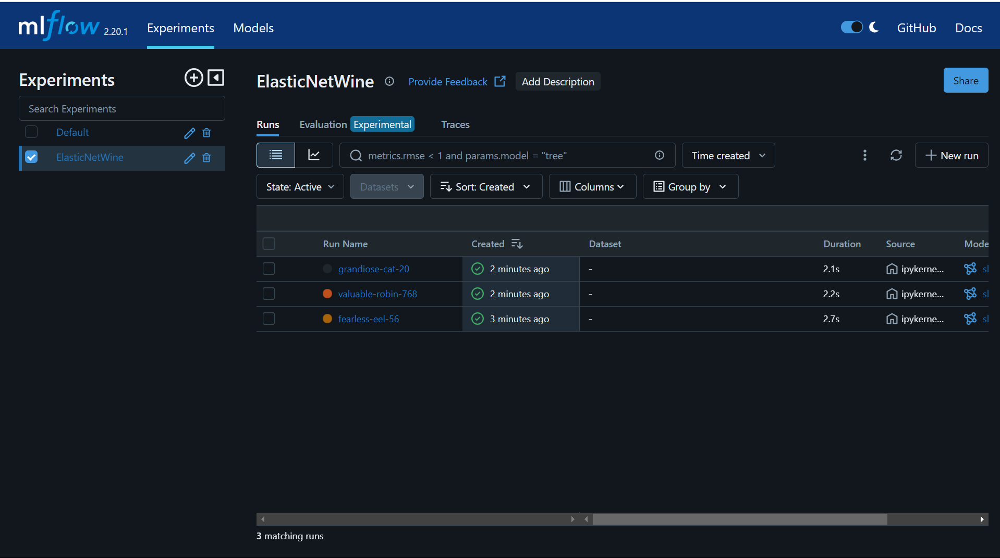

# MLFlow Hands-On Walkthrough

This repository contains the steps to complete the hands-on MLFlow walkthrough, including installing MLFlow, running MLFlow server, and capturing all the necessary information for submission.

## Install MLFlow:

Use the following command to install MLFlow in your environment:

``` bash
pip install mlflow
```

## Run the MLFlow Server:

``` bash
mlflow ui
```

## Screenshot:



## Run ipynb file:

Run `mlflow.ipynb` to log into MLFlow.

## Screenshot:


